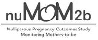

 
 
 

I am Associate Professor in the Department of Epidemiology at the [Rollins School of Public Health](https://www.sph.emory.edu/), Emory University. I have a PhD in Epidemiology and Biostatistics, with expertise in causal inference, machine learning, and artificial intelligence methods. Substantively, I leverage this expertise to answer questions related to reproductive and perinatal epidemiology, nutritional epidemiology, social determinants of health, and (recently) infectious diseases.

A recent copy of my CV is available [here](files/CV.ain.Jan2021.pdf).

 
 
 
 

# Projects

 

### Compliance Adjustment in the Effects of Aspirin on Gestation and Reproduction (R01)

     
The Effects of Aspirin in Gestation and Reproduction (EAGeR) study was a randomized trial of low-dose aspirin to prevent miscarriage and promote live birth. Complex longitudinal data were collected in this trial, and we are currently using a range of methods to estimate per protocol effects, adjust for measurement error, and to transport the estimated per protocol effects to a more representative population.

### Media Coverage: 

- **NYTimes**: "A ‘Baby’ Aspirin a Day May Help Prevent a Second Pregnancy Loss", available [here](https://www.nytimes.com/2021/01/27/well/family/aspirin-pregnancy-miscarriage.html)

- **U.S. News and World Report**: "For Women Who've Miscarried, Aspirin Before, During Pregnancy Could Improve Outcomes", available [here](https://www.usnews.com/news/health-news/articles/2021-01-26/for-women-whove-miscarried-aspirin-before-during-pregnancy-could-improve-outcomes)

- **Healio Medical News**: "Low-dose aspirin improves chances of pregnancy after miscarriage", available [here](https://www.healio.com/news/primary-care/20210125/lowdose-aspirin-improves-chances-of-pregnancy-after-miscarriage)

- **Healthline Medical News**: "Low-Dose Aspirin May Help Pregnant People With History of Pregnancy Loss", available [here](https://www.healthline.com/health-news/low-dose-aspirin-may-help-pregnant-women-with-history-of-pregnancy-loss#Low-dose-aspirin-can-improve-pregnancy-outcomes-in-at-risk-people)

 

### Informing national guidelines on diet patterns that promote healthy pregnancy outcomes

     
The Nulliparous Pregnancy Outcomes Study: Monitoring Mothers-to-Be (nuMoM2b) study was an observational cohort study of a range of factors affecting pregnancies of nulliparous women. [Dr Lisa Bodnar](https://publichealth.pitt.edu/home/directory/lisa-m-bodnar) and I are currently using machine learning and causal inference techniques to evaluate patterns in diet that maximize positive pregnancy outcomes.

 
 
 
 

___

 **Our work is supported by** 
 

 

___